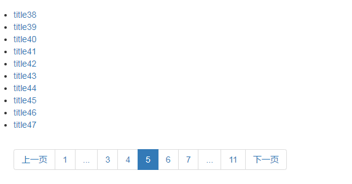

# 分页功能

在django中分页功能的实现依赖Page和Paginator对象，这两个对象里面封装好了，分页功能需要用到的参数。

## Page对象 
这个对象里面有分页的数据和常用的分页参数
1. `has_next()`, 判断是否有下一页
2. `has_previous()`,判断是否有上一页
3. `has_other_pages()`, 判断是否有上一页或者下一页
4. `next_page_number()`,返回下一页的页码
5. `previous_page_number()`,返回上一页的页码
6. `start_index()`,返回当前页面的开始索引
7. `end_index()`,返回当前页面的结束索引

## Paginator对象
这个对象就是对QuerySet对象的分页封装，接收2个参数，一个是QuerySet集合，一个是每个分页的页面展示多少条数据。
`paginator = Paginator(onj_list,per_page)`

这个对象有3个常用的属性和1个常用的方法：
1. `count`，返回所有分页数据的条数
2. `num_pages`，返回分页数据的总页数
3. `page_range`，返回分页数据的页码范围
4. `get_page(number)`,返回number页码的分页数据，是一个`Page`对象

## 在代码中使用分页的功能

### 自己实现

要实现分页功能，首先要配置2个参数，一个是每页的数据条数，一个是每页分页传递的参数。有了这两个参数，我们就可以对QuerySet对象进行切片操作返回。这是一种实现方式，这种方式使用的话，要自己手动计算分页需要的参数,比如是否有上一页，上一页的页码等等。

### 采用django内置的分页类来实现
```python
# views.py
from django.core.paginator import Paginator
# around_count参数表示在当前页前面或者后面的页码个数
def get_pagination_data(page, paginator, around_count=2):
    # 获取当前的页码
    current_page = page.number
    # 判断左边是否有更多
    left_has_more = False
    # 判断右边是否有更多
    right_has_more = False
    # 获取左边的页码区间
    if current_page <= around_count + 2:
        left_pages = range(1, current_page)
    else:
        left_has_more = True
        left_pages = range(current_page - around_count, current_page)
    # 获取右边的页码区间
    if current_page >= paginator.num_pages - 3:
        right_pages = range(current_page + 1, paginator.num_pages + 1)
    else:
        right_has_more = True
        right_pages = range(current_page + 1, current_page + 3)
    return {
        "left_pages": left_pages,
        "right_pages": right_pages,
        "right_has_more": right_has_more,
        "left_has_more": left_has_more
    }


def index(request):
    # 获取分页的页码，默认是第一页
    number = request.GET.get("page", 1)
    # 将QuerySet对像封装成paginator对象
    paginator = Paginator(Article.objects.all(), per_page=10)
    # 获取当前页的Page对象
    page = paginator.get_page(number)
    # 获取分页参数
    pagination_data = get_pagination_data(page, paginator)
    context = {
        "paginator": paginator,
        "page": page
    }
    context.update(pagination_data)
    return render(request, "index.html", context=context)
```
在index.html中
```html
<ul>
        
            <li><a href="#">{{ article.title }}</a></li>
        
    </ul>

    <ul class="pagination">
        
            <li><a href="?page={{ page.previous_page_number }}">上一页</a></li>
        
            <li class="disabled"><a href="javascript:void(0);">上一页</a></li>
        
        
            <li><a href="?page=1">1</a></li>
            <li><a href="javascript:void (0);">...</a></li>
        

{#        左边的页码#}
        
            <li><a href="?page={{ left_page }}">{{ left_page }}</a></li>
        

{#        中间的页码#}
        <li class="active"><a href="javascript:void(0);">{{ page.number }}</a></li>
{#        右边的页码#}
        
            <li><a href="?page={{ right_page }}">{{ right_page }}</a></li>
        

        
            <li><a href="javascript:void (0);">...</a></li>
            <li><a href="?page={{ paginator.num_pages }}">{{ paginator.num_pages }}</a></li>
        
{#        #}
{#            #}
{#                <li class="active"><a href="?page={{ num }}">{{ num }}</a></li>#}
{#            #}
{#                <li><a href="?page={{ num }}">{{ num }}</a></li>#}
{#            #}
{#        #}

        
            <li><a href="?page={{ page.next_page_number }}">下一页</a></li>
        
            <li class="disabled"><a href="javascript:void(0);">下一页</a></li>
        
    </ul>
```
最后的效果如下：

