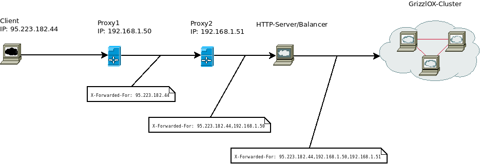

## 限速节流（Throttling）：

使用`drf`可以给我们的网站`API`限速节流。比如一些爬虫，爬你网站的数据，那么我们可以通过设置访问的频率和次数来限制他的行为。

## 配置：

限速节流配置也是分成两种。第一种是直接在`settings.REST_FRAMEWORK`中设置，第二种是针对每个视图函数进行设置。配置分成两个，一个是`throttle_classes`，另外一个是`throttle_rates`。前者是配置不同的节流方式，后者是配置节流的策略。示例代码如下：
```python
# settings.py
REST_FRAMEWORK = {
    'DEFAULT_THROTTLE_CLASSES': [
        'rest_framework.throttling.AnonRateThrottle',
        'rest_framework.throttling.UserRateThrottle'
    ],
    'DEFAULT_THROTTLE_RATES': {
        'anon': '100/day',
        'user': '1000/day'
    }
}

# views.py
from rest_framework.response import Response
from rest_framework.throttling import UserRateThrottle
from rest_framework.views import APIView

class ExampleView(APIView):
    throttle_classes = [UserRateThrottle]

    def get(self, request, format=None):
        content = {
            'status': 'request was permitted'
        }
        return Response(content)
```
## 节流的类：

在`drf`中，节流的类总共有以下三个：

### `AnonRateThrottle`：

针对那些没有登录的用户进行节流。默认会根据`REMOTE_ADDR`，也就是用户的IP地址作为限制的标记。如果用户使用了透明代理（匿名代理没法追踪），那么在`X-Forwarded-For`中会保留所有的代理的IP。比如下图：

这时候就要看在`settings.REST_FRAMEWORK.NUM_PROXIES`了，如果这个值设置的是0，那么那么将获取REMOTE_ADDR也就是真实的IP地址，如果设置的是大于0的数，那么将获取代理的最后一个IP。

### `UserRateThrottle`:
根据用户的`id`来作为节流的标识。可以通过两种方式设置节流的策略。

1. 在`settings.REST_FRAMEWORK.DEFAULT_THROTTLE_RATES['user']`设置。
2. 自定义节流类，继承自`UserRateThrottle`，然后重写`rate`属性。

如果想要针对不同类型的用户实现不同策略的节流，我们可以通过继承`UserRateThrottle`类，然后设置`scope`属性，然后针对不同的`scope`设置不同的节流策略。比如针对管理员`admin`和普通用户`normal`，可以设置不同的策略。代码如下：
```python
class AdminRateThrottle(UserRateThrottle):
    scope = 'admin'

class NormalRateThrottle(UserRateThrottle):
    scope = 'normal'
```
然后在`settings.py`中可以如下设置：
```python
REST_FRAMEWORK = {
    'DEFAULT_THROTTLE_CLASSES': [
        'example.throttles.AdminRateThrottle',
        'example.throttles.NormalRateThrottle'
    ],
    'DEFAULT_THROTTLE_RATES': {
        'normal': '60/day',
        'admin': '1000/day'
    }
}
```
### ScopedRateThrottle：
这个就不管是登录用户，还是没有登录的用户。都是根据`scope`来实现节流策略的。这个就只需要在视图中，重写`throttle_scope`属性，指定具体的`scope`，然后在`settings.py`中进行设置。示例代码如下：
```python
# views.py
class ContactListView(APIView):
    throttle_scope = 'contacts'
    ...

class ContactDetailView(APIView):
    throttle_scope = 'contacts'
    ...

class UploadView(APIView):
    throttle_scope = 'uploads'
    ...

# settings.py
REST_FRAMEWORK = {
    'DEFAULT_THROTTLE_CLASSES': [
        'rest_framework.throttling.ScopedRateThrottle',
    ],
    'DEFAULT_THROTTLE_RATES': {
        'contacts': '1000/day',
        'uploads': '20/day'
    }
}
```